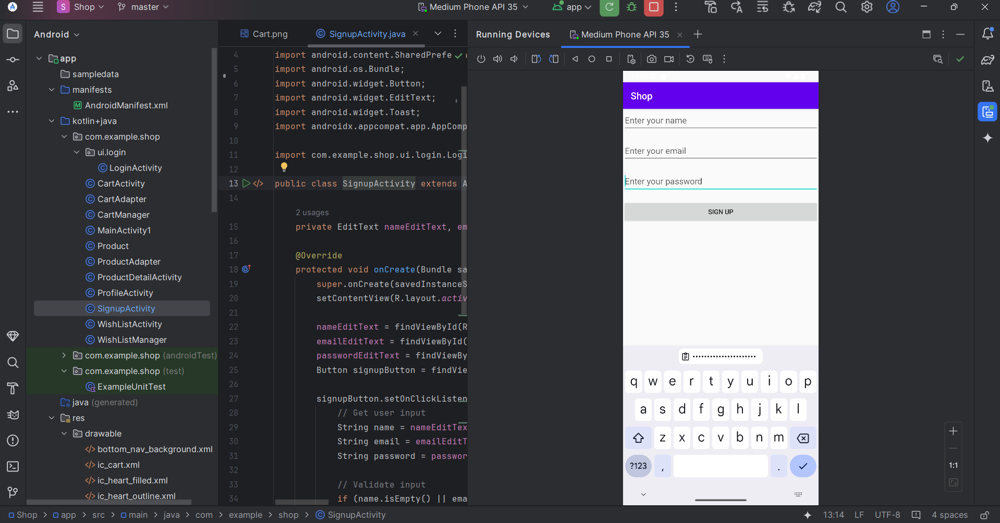
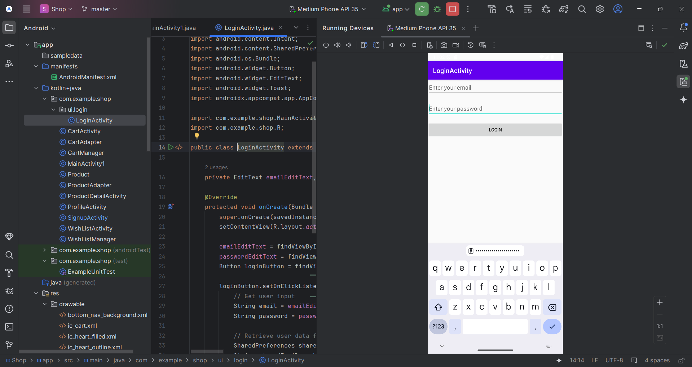
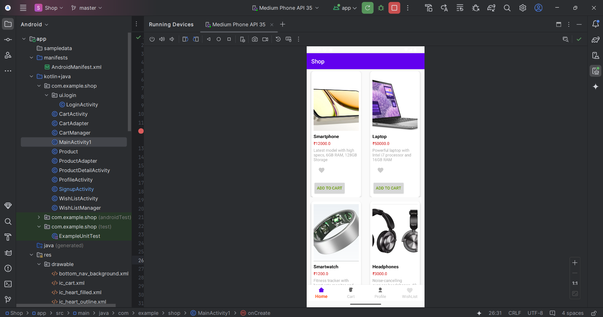
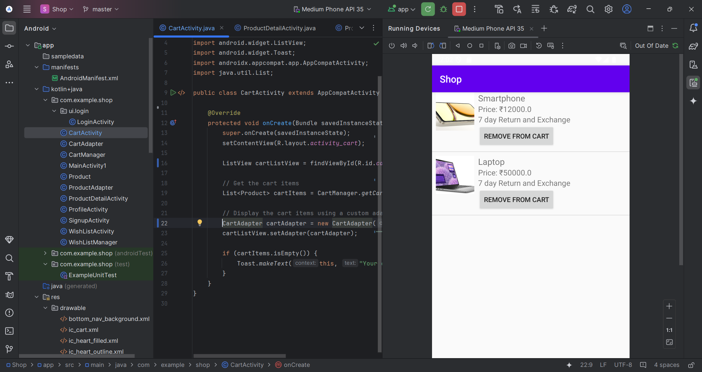
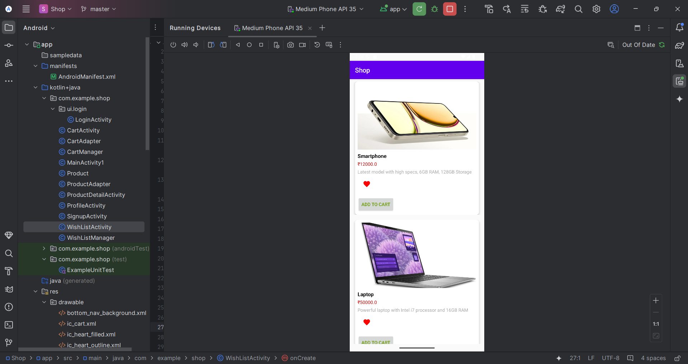
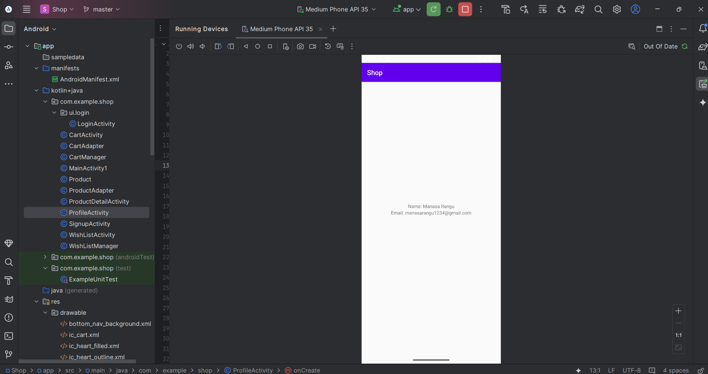
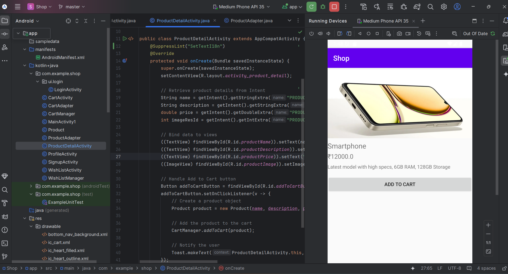

# ShopEaseApp

Welcome to *ShopEaseApp*, your one-stop shop for all your product needs!

## Features
- Browse products in a grid layout
- View detailed product information
- Add items to cart and wishlist
- Profile management

## Screenshots

Here are some screenshots of the app:

- *Sign Up Screen*  
  

- *Login Screen*  
  

- *Home Screen*  
  

- *Cart Screen*  
  

- *Wish List Screen*  
  

- *User Profile Screen*  
  

- *Product Detail View*  
  

## Installation

1. Clone the repository:
   ```bash
   git clone https://github.com/manasa-rangu12/ShopEaseApp.git

2. Open the project in Android Studio.

3. Run the app on an emulator or device.
